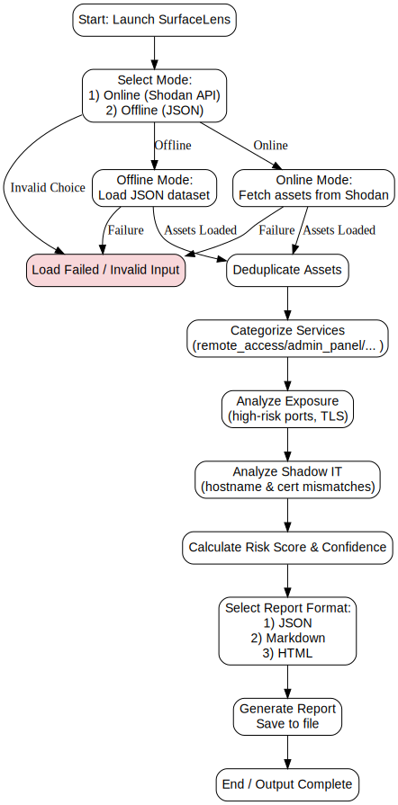

# SurfaceLens


**SurfaceLens** is a **passive attack surface and Shadow IT intelligence engine** built to help security teams understand **what assets are exposed, why it matters, and which risks are critical**, all without touching or probing the network.

---

## Why SurfaceLens Matters

Modern organizations often **lose visibility over their attack surface**:

* Cloud assets spun up outside official processes
* Internet-exposed admin panels and databases
* High-risk services accidentally left public
* Shadow IT infrastructure hiding in plain sight

SurfaceLens gives security teams a **clear, actionable map** of exposure and potential risk — **without active scanning**.

---

## Architecture Overview

<p align="center">
  
</p>

---

## How SurfaceLens Works

1. **Mode Selection**
   Users select **Online Mode** (Shodan API) or **Offline Mode** (JSON dataset).

2. **Asset Deduplication**
   Removes duplicates and tracks **first/last seen timestamps**.

3. **Passive Analysis Pipeline** (per asset)

   * **Service Categorization** — remote access, admin panel, database, etc.
   * **Exposure Analysis** — high-risk ports, missing TLS
   * **Shadow IT Detection** — hostname & certificate mismatches
   * **Risk Scoring** — numeric score (0–10) with confidence and reasoning

4. **Report Generation**

   * Formats: JSON (structured), Markdown (audits), HTML (executive-friendly)
   * Timestamped and ready for documentation or presentation

---

## Key Capabilities

* **Passive** asset discovery — no scanning or exploitation
* Shadow IT detection with confidence scoring
* Explainable risk scoring per asset
* Deduplication with timeline awareness
* Multi-format, portfolio-ready reporting
* Supports **online** (Shodan) and **offline** (JSON) workflows

---

## Installation

```bash
git clone https://github.com/404saint/surfacelens.git
cd surfacelens
pip install shodan
```

> Python 3.9+ recommended

### Optional — Online Mode

Set your Shodan API key:

```bash
export SHODAN_API_KEY="YOUR_API_KEY"
```

Offline mode works fully without Shodan.

---

## Usage

```bash
python surfacelens.py
```

**Interactive prompts guide you through:**

1. Selecting mode (Online / Offline)
2. Providing organization or ASN (Online) or JSON dataset path (Offline)
3. Asset analysis (categorization, exposure, Shadow IT, risk scoring)
4. Generating reports (JSON / Markdown / HTML)

---

## Example Output (Per Asset)

* **Service Category**
* **Exposure Findings**
* **Shadow IT Indicators** (with confidence)
* **Risk Score & Confidence**
* **Risk Reasoning**

> Outputs are suitable for **technical teams, leadership, and audit documentation**.

---

## Ethical Use & Non-Goals

SurfaceLens is **strictly passive and defensive**:

* No active scanning
* No exploitation or brute forcing
* Use only on assets you own or are authorized to assess

---

## License

MIT License
